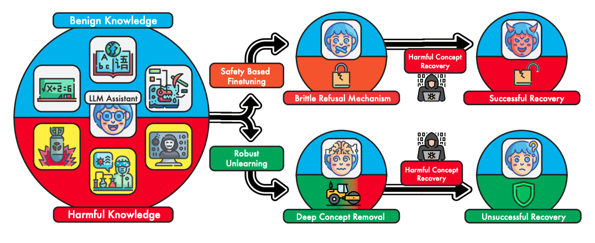

<!-- --- -->

<!-- ##### Links -->

<!-- + [Paper](paper1.pdf) -->
<!-- + [Online appendix](appendix1.pdf) -->
<!-- + [Code and data](https://github.com/pmichaillat/job-rationing) -->

---

##### Abstract

Recent rapid advances in AI enabled by large language models (LLMs) have raised widespread concerns regarding their potential for malicious misuse. While traditional open-source software has long established mechanisms for combating such adversarial behavior, systems involving large neural networks are nontrivial to interpret—let alone intervene on—for safe use. Various alignment methods have been proposed to steer model responses towards a desired "safe" output distribution. However, these techniques are superficial and remain susceptible to adversarial prompting, and can be undone entirely with supervised fine-tuning. These vulnerabilities necessitate a machine unlearning approach, in which the underlying representations of these target concepts are corrupted or forgotten. We introduce state-of-the-art methods for unlearning desired concepts from LLMs. We demonstrate our results on the MMLU benchmark, showing that we can decrease accuracy on a forget set of concepts to chance levels while maintaining accuracy on the retain set.

---

##### Figure 1: The necessity of robust unlearning.



---

<!-- ##### Citation

```BibTeX
@article{AAYY,
author = {Author},
doi = {paper_doi},
journal = {Journal},
number = {Issue},
pages = {XXX--YYY},
title ={Title},
volume = {Volume},
year = {Year}}
```

---

##### Related material

+ [Presentation slides](presentation1.pdf)
+ [Dissertation title](https://escholarship.org/uc/item/7jr3m96r) – PhD dissertation on which this paper is based.
+ [Column title](https://cep.lse.ac.uk/pubs/download/cp365.pdf) – Nontechnical column describing the paper. -->

