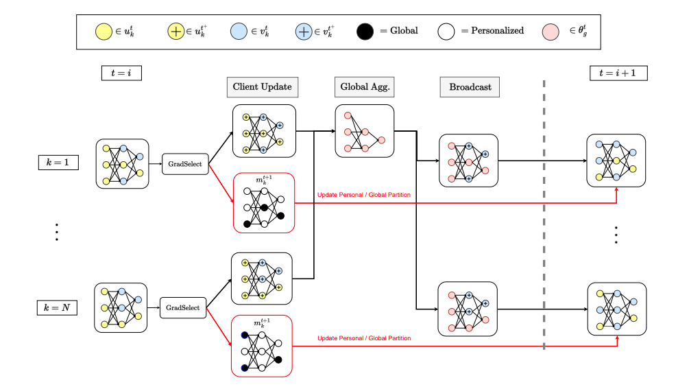

---

##### Links
+ [Paper (CVPR 2024)](https://arxiv.org/pdf/2404.02478.pdf)
+ [Paper (ICML 2023 Workshop Ver.)](https://arxiv.org/pdf/2306.13264.pdf)
<!-- + [Project Page (with code & data)](https://www.wmdp.ai/) -->
<!-- + [Online appendix](appendix2.pdf) -->

---

##### Abstract

Standard federated learning approaches suffer when client data distributions have sufficient heterogeneity. Recent methods addressed the client data heterogeneity issue via personalized federated learning (PFL) - a class of FL algorithms aiming to personalize learned global knowledge to better suit the clients' local data distributions. Existing PFL methods usually decouple global updates in deep neural networks by performing personalization on particular layers (i.e. classifier heads) and global aggregation for the rest of the network. However, preselecting network layers for personalization may result in suboptimal storage of global knowledge. In this work, we propose FedSelect, a novel PFL algorithm inspired by the iterative subnetwork discovery procedure used for the Lottery Ticket Hypothesis. FedSelect incrementally expands subnetworks to personalize client parameters, concurrently conducting global aggregations on the remaining parameters. This approach enables the personalization of both client parameters and subnetwork structure during the training process. Finally, we show that FedSelect outperforms recent state-of-the-art PFL algorithms under challenging client data heterogeneity settings and demonstrates robustness to various real-world distributional shifts.

---

##### Figure 1: Illustration of the FEDSELECT algorithm



<!-- --- -->

<!-- ##### Citation

```BibTeX
@misc{li2024wmdp,
title={The WMDP Benchmark: Measuring and Reducing Malicious Use With Unlearning},
author={Nathaniel Li and Alexander Pan and Anjali Gopal and Summer Yue and Daniel Berrios and Alice Gatti and Justin D. Li and Ann-Kathrin Dombrowski and Shashwat Goel and Long Phan and Gabriel Mukobi and Nathan Helm-Burger and Rassin Lababidi and Lennart Justen and Andrew B. Liu and Michael Chen and Isabelle Barrass and Oliver Zhang and Xiaoyuan Zhu and Rishub Tamirisa and Bhrugu Bharathi and Adam Khoja and Ariel Herbert-Voss and Cort B. Breuer and Andy Zou and Mantas Mazeika and Zifan Wang and Palash Oswal and Weiran Liu and Adam A. Hunt and Justin Tienken-Harder and Kevin Y. Shih and Kemper Talley and John Guan and Russell Kaplan and Ian Steneker and David Campbell and Brad Jokubaitis and Alex Levinson and Jean Wang and William Qian and Kallol Krishna Karmakar and Steven Basart and Stephen Fitz and Mindy Levine and Ponnurangam Kumaraguru and Uday Tupakula and Vijay Varadharajan and Yan Shoshitaishvili and Jimmy Ba and Kevin M. Esvelt and Alexandr Wang and Dan Hendrycks},
year={2024},
eprint={2403.03218},
archivePrefix={arXiv},
primaryClass={cs.LG}
}
``` -->
