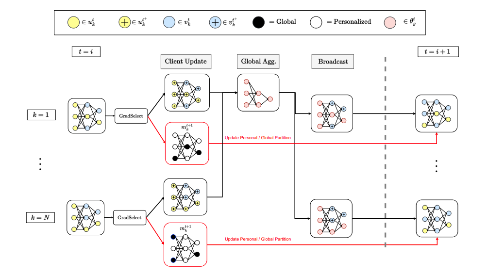

---

##### Links
+ [Paper (CVPR 2024)](https://arxiv.org/pdf/2404.02478.pdf)
+ [Paper (ICML 2023 Workshop Ver.)](https://arxiv.org/pdf/2306.13264.pdf)

---

##### Abstract

Standard federated learning approaches suffer when client data distributions have sufficient heterogeneity. Recent methods addressed the client data heterogeneity issue via personalized federated learning (PFL) - a class of FL algorithms aiming to personalize learned global knowledge to better suit the clients' local data distributions. Existing PFL methods usually decouple global updates in deep neural networks by performing personalization on particular layers (i.e. classifier heads) and global aggregation for the rest of the network. However, preselecting network layers for personalization may result in suboptimal storage of global knowledge. In this work, we propose FedSelect, a novel PFL algorithm inspired by the iterative subnetwork discovery procedure used for the Lottery Ticket Hypothesis. FedSelect incrementally expands subnetworks to personalize client parameters, concurrently conducting global aggregations on the remaining parameters. This approach enables the personalization of both client parameters and subnetwork structure during the training process. Finally, we show that FedSelect outperforms recent state-of-the-art PFL algorithms under challenging client data heterogeneity settings and demonstrates robustness to various real-world distributional shifts.

---

##### Figure 1: Illustration of the FEDSELECT algorithm

