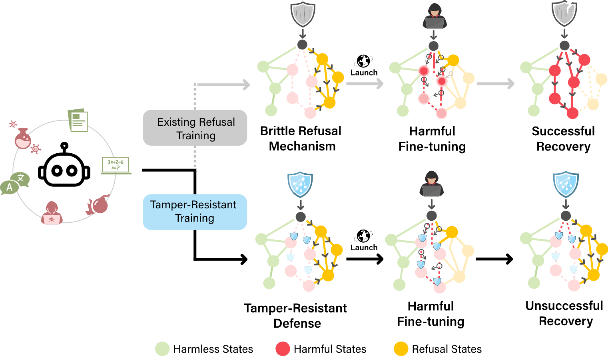

---

##### Links
+ [Paper (arxiv)](https://arxiv.org/abs/2408.00761)
<!-- + [Project Page (with code & data)](https://www.wmdp.ai/) -->
<!-- + [Online appendix](appendix2.pdf) -->

---

##### Abstract

Rapid advances in the capabilities of large language models (LLMs) have raised widespread concerns regarding their potential for malicious use. Open-weight LLMs present unique challenges, as existing safeguards lack robustness to tampering attacks that modify model weights. For example, recent works have demonstrated that refusal and unlearning safeguards can be trivially removed with a few steps of fine-tuning. These vulnerabilities necessitate new approaches for enabling the safe release of open-weight LLMs. We develop a method, called TAR, for building tamper-resistant safeguards into open-weight LLMs such that adversaries cannot remove the safeguards even after thousands of steps of fine-tuning. In extensive evaluations and red teaming analyses, we find that our method greatly improves tamper-resistance while preserving benign capabilities. Our results demonstrate that tamper-resistance is a tractable problem, opening up a promising new avenue to improve the safety and security of open-weight LLMs.

---

##### Figure 1: Tamper-Resistant Safeguards



<!-- --- -->

<!-- ##### Citation

```BibTeX
@misc{li2024wmdp,
title={The WMDP Benchmark: Measuring and Reducing Malicious Use With Unlearning},
author={Nathaniel Li and Alexander Pan and Anjali Gopal and Summer Yue and Daniel Berrios and Alice Gatti and Justin D. Li and Ann-Kathrin Dombrowski and Shashwat Goel and Long Phan and Gabriel Mukobi and Nathan Helm-Burger and Rassin Lababidi and Lennart Justen and Andrew B. Liu and Michael Chen and Isabelle Barrass and Oliver Zhang and Xiaoyuan Zhu and Rishub Tamirisa and Bhrugu Bharathi and Adam Khoja and Ariel Herbert-Voss and Cort B. Breuer and Andy Zou and Mantas Mazeika and Zifan Wang and Palash Oswal and Weiran Liu and Adam A. Hunt and Justin Tienken-Harder and Kevin Y. Shih and Kemper Talley and John Guan and Russell Kaplan and Ian Steneker and David Campbell and Brad Jokubaitis and Alex Levinson and Jean Wang and William Qian and Kallol Krishna Karmakar and Steven Basart and Stephen Fitz and Mindy Levine and Ponnurangam Kumaraguru and Uday Tupakula and Vijay Varadharajan and Yan Shoshitaishvili and Jimmy Ba and Kevin M. Esvelt and Alexandr Wang and Dan Hendrycks},
year={2024},
eprint={2403.03218},
archivePrefix={arXiv},
primaryClass={cs.LG}
}
``` -->
