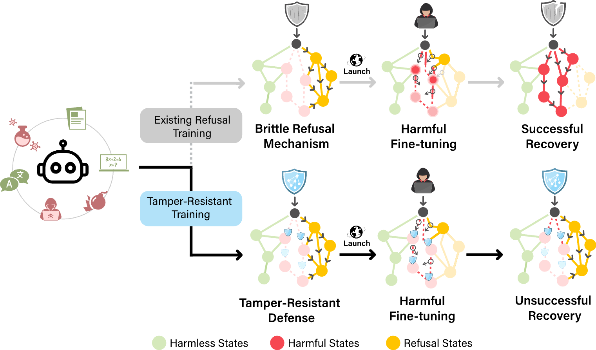

---

##### Links
+ [Paper (arxiv)](https://arxiv.org/abs/2408.00761)
+ [Project Page](https://www.tamper-resistant-safeguards.com/)

---

##### Abstract

Rapid advances in the capabilities of large language models (LLMs) have raised widespread concerns regarding their potential for malicious use. Open-weight LLMs present unique challenges, as existing safeguards lack robustness to tampering attacks that modify model weights. For example, recent works have demonstrated that refusal and unlearning safeguards can be trivially removed with a few steps of fine-tuning. These vulnerabilities necessitate new approaches for enabling the safe release of open-weight LLMs. We develop a method, called TAR, for building tamper-resistant safeguards into open-weight LLMs such that adversaries cannot remove the safeguards even after thousands of steps of fine-tuning. In extensive evaluations and red teaming analyses, we find that our method greatly improves tamper-resistance while preserving benign capabilities. Our results demonstrate that tamper-resistance is a tractable problem, opening up a promising new avenue to improve the safety and security of open-weight LLMs.

---

##### Figure 1: Tamper-Resistant Safeguards

